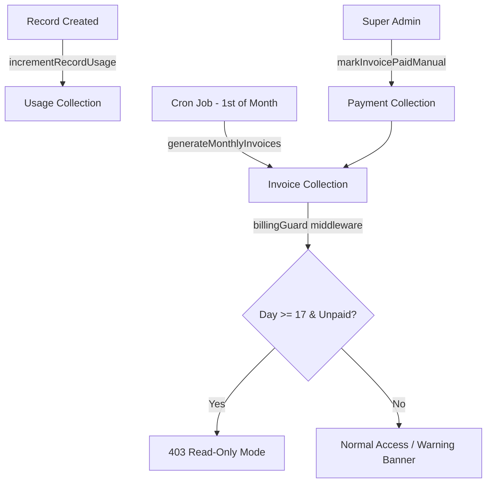

# Billing System — Code Review & API Reference

## Architecture Overview



| Layer | Files |
|---|---|
| **Models** | `Usage.js`, `Invoice.js`, `Payment.js`, `BillingSettings.js` |
| **Services** | `usage.service.js`, `billing.service.js` |
| **Middleware** | `billingGuard.js` |
| **Controllers** | `billingController.js` |
| **Routes** | `billing.routes.js` → `/api/billing`, `adminBilling.routes.js` → `/api/admin/billing` |
| **Jobs** | `billing.cron.js` (1st of every month at 00:05) |
| **Utilities** | `billingPeriod.js` |

---

## Code Review — Issues Found

### 🐛 Bug: `/api/billing/invoices` uses wrong field name

**File:** `billing.routes.js:95`

```js
const { agencyId } = req.user;  // ❌ req.user has "agency", NOT "agencyId"
```

The entire codebase uses `req.user.agency` (ObjectId). This endpoint will always query with `agencyId = undefined`, returning zero invoices for every user.

**Fix:** Change to `const agencyId = req.user.agency;`

---

### ⚠️ Issue: `test-generate` hardcodes `unitPrice: 0.02`

**File:** `billing.routes.js:78`

The `BillingSettings` model exists with per-agency `unitPrice` & `currency`, and `billing.service.js` uses it correctly. But `test-generate` ignores it and hardcodes `0.02`. If you ever change an agency's pricing, test-generate results won't match real invoices.

---

### 🧹 Cleanup: Dead commented-out code

**File:** `billing.routes.js:30-53`

The old version of `test-generate` is still sitting in a comment block. Should be removed.

---

### ⚠️ Issue: `test-generate` doesn't check for duplicate invoices

`billing.service.js` skips agencies that already have an invoice for a period, but `test-generate` doesn't — hitting it twice for the same agency/period will throw a **duplicate key error** (unique index on `agencyId + periodKey`).

---

### ℹ️ Note: Cron job import

**File:** `billing.cron.js` — `startBillingJobs()` is exported but not called anywhere in `server.js`. Make sure it's invoked during startup or the monthly invoicing won't run.

---

## API Endpoints for Postman

> **Base URL:** `http://localhost:4000`
> All protected routes require `Authorization: Bearer <token>` header.

---

### 1. Login (get your token)

| | |
|---|---|
| **Method** | `POST` |
| **URL** | `/api/auth/login` |
| **Auth** | None |

**Body (JSON):**
```json
{
  "email": "superadmin@example.com",
  "password": "SuperStrongPassword123!"
}
```

**Response:** Copy the `token` field for use in all subsequent requests.

---

### 2. Get Billing Status

| | |
|---|---|
| **Method** | `GET` |
| **URL** | `/api/billing/status` |
| **Auth** | Bearer Token |

Returns the current billing status banner (`ok`, `unpaid_warning`, or `read_only`).

**Response example:**
```json
{
  "billing": { "status": "ok" }
}
```

---

### 3. Debug Usage (view usage records for your agency)

| | |
|---|---|
| **Method** | `GET` |
| **URL** | `/api/billing/debug-usage` |
| **Auth** | Bearer Token |

**Response example:**
```json
{
  "count": 1,
  "items": [
    {
      "_id": "...",
      "agencyId": "68b036b767c18d76193e7b91",
      "periodKey": "2026-02",
      "recordsCreated": 5,
      "periodStart": "2026-02-01T00:00:00.000Z",
      "periodEnd": "2026-02-28T23:59:59.999Z"
    }
  ]
}
```

---

### 4. Test Generate Invoice

| | |
|---|---|
| **Method** | `POST` |
| **URL** | `/api/billing/test-generate` |
| **Auth** | Bearer Token |

**Super Admin override** — pass a specific agency:
```
/api/billing/test-generate?agencyId=68b036b767c18d76193e7b91
```

> ⚠️ The agency must have at least one Usage record. Create a record first if needed.

**Response example:**
```json
{
  "invoice": {
    "_id": "...",
    "agencyId": "68b036b767c18d76193e7b91",
    "periodKey": "2026-02",
    "recordsBilled": 5,
    "unitPrice": 0.02,
    "currency": "USD",
    "amount": 0.10,
    "status": "unpaid",
    "issuedAt": "2026-02-22T...",
    "dueAt": "2026-02-16T23:59:59.999Z"
  }
}
```

---

### 5. List Invoices

| | |
|---|---|
| **Method** | `GET` |
| **URL** | `/api/billing/invoices` |
| **Auth** | Bearer Token |

> ⚠️ **Currently broken** — uses `req.user.agencyId` instead of `req.user.agency`. See bug fix above.

**Expected response (after fix):**
```json
{
  "invoices": [
    {
      "_id": "...",
      "agencyId": "...",
      "periodKey": "2026-02",
      "amount": 0.10,
      "status": "unpaid",
      "issuedAt": "...",
      "dueAt": "..."
    }
  ]
}
```

---

### 6. Mark Invoice as Paid (Super Admin only)

| | |
|---|---|
| **Method** | `POST` |
| **URL** | `/api/admin/billing/invoices/:invoiceId/mark-paid` |
| **Auth** | Bearer Token (Super Admin) |
| **Role** | `SUPER_ADMIN` only |

**Body (JSON):**
```json
{
  "amount": 0.10,
  "currency": "USD",
  "providerRef": "TXN-12345",
  "note": "Paid via bank transfer"
}
```
> All body fields are optional. Defaults to the invoice's `amount` and `currency`.

**Response example:**
```json
{
  "message": "Invoice marked as paid",
  "invoice": { "...": "...", "status": "paid", "paidAt": "..." },
  "payment": { "...": "...", "provider": "manual", "status": "succeeded" }
}
```

---

### 7. Create a Record (triggers usage tracking)

| | |
|---|---|
| **Method** | `POST` |
| **URL** | `/api/records` |
| **Auth** | Bearer Token |

**Body (JSON):**
```json
{
  "customerName": "Test Customer",
  "typeOfService": "flight",
  "sellingPrice": 100,
  "buyingPrice": 80,
  "expenses": 5
}
```

> This triggers `incrementRecordUsage()` which creates/updates the Usage doc for the current month. **You must create at least one record before test-generate will work for an agency.**

---

## Suggested Testing Flow in Postman

```
1. POST /api/auth/login          → Get token (Super Admin)
2. POST /api/records             → Create a record (this creates Usage)
3. GET  /api/billing/debug-usage → Verify usage was tracked
4. POST /api/billing/test-generate?agencyId=<id> → Generate invoice
5. GET  /api/billing/invoices    → List invoices (after bug fix)
6. POST /api/admin/billing/invoices/<invoiceId>/mark-paid → Pay it
7. GET  /api/billing/status      → Should now show "ok"
```
